# PROSALE   

## Giới thiệu
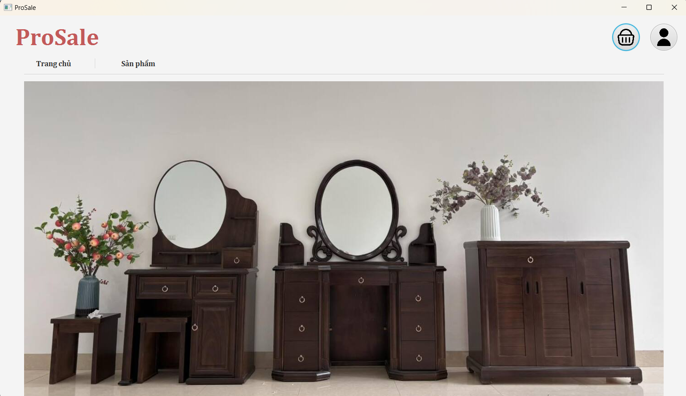
- Bạn là một chủ cửa hàng nội thất và muốn quản lý hàng hóa trong kho, quản lý đơn hàng và muốn khách hàng có thể mua hàng dễ dàng , thuật tiện. Đây là một ứng dụng dành cho bạn. Ứng dụng gồm 2 giao diện dành cho quản lý và người dùng riêng biệt. 

## Tính năng

**Tính năng chung** 
- Đăng nhập

- Xem danh sách sản phẩm
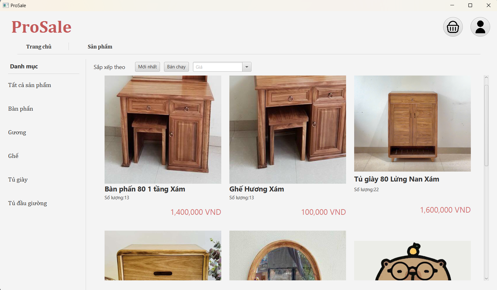
- Xem chi tiết sản phẩm: tên, mẫu mã, chất liệu, số lượng tồn kho, mô tả ....
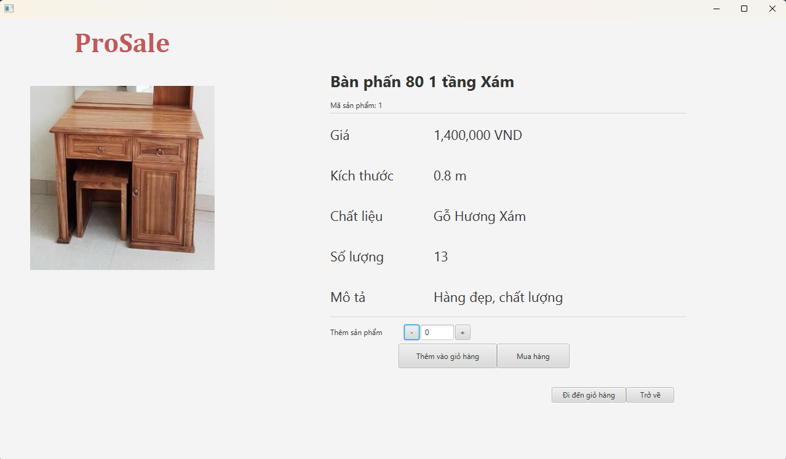
- Xem hồ sơ của bản thân
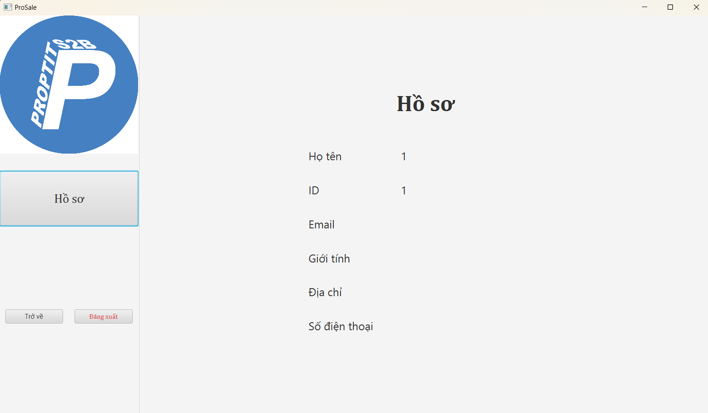
  

**Tính năng của quản lý**
- Cập nhật số lượng sản phẩm.
- 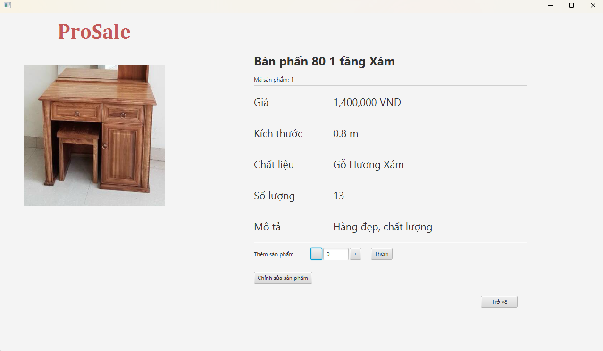
- Thêm sản phẩm mới vào danh sách sản phẩm
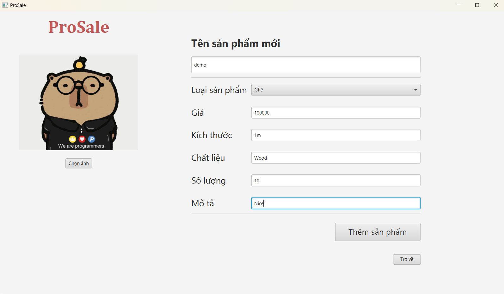
- Quản lý đơn hàng của khách : cập nhật, thực hiện đơn hàng
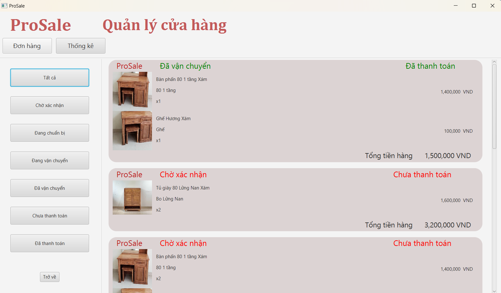
- Thống kê doanh thu bán ra, cơ cấu bán hàng.
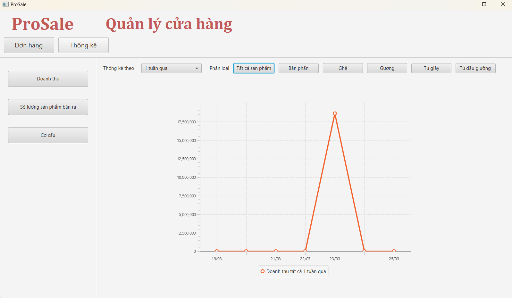


**Tính năng của khách hàng**
- Đăng ký (Nếu chưa có tài khoản).
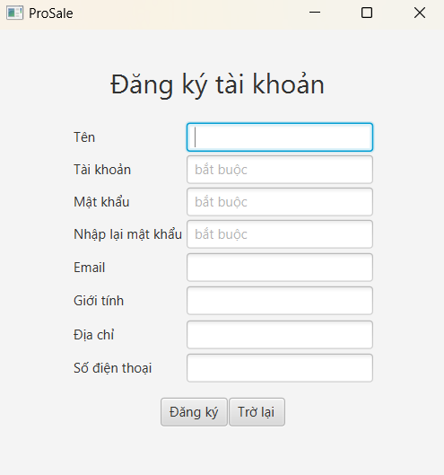
- Thêm sản phẩm vào giỏ hàng.
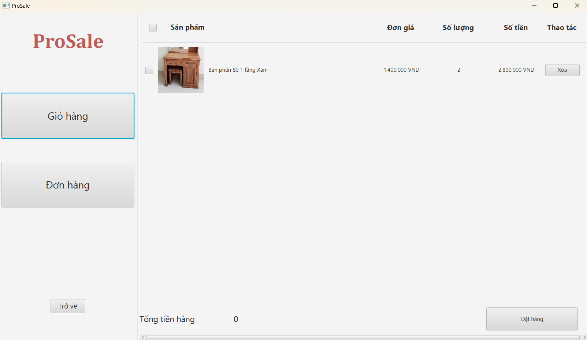
- Mua hàng.
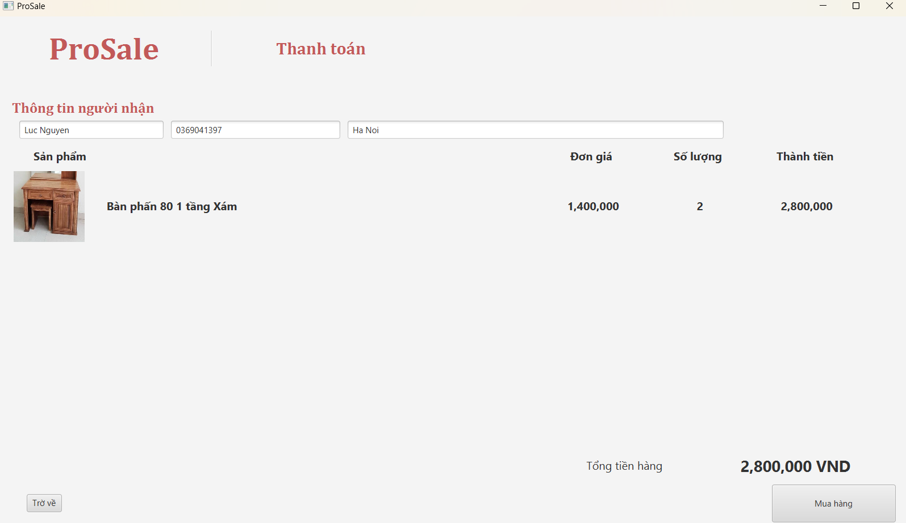
- Xem danh sách đơn hàng đã mua.
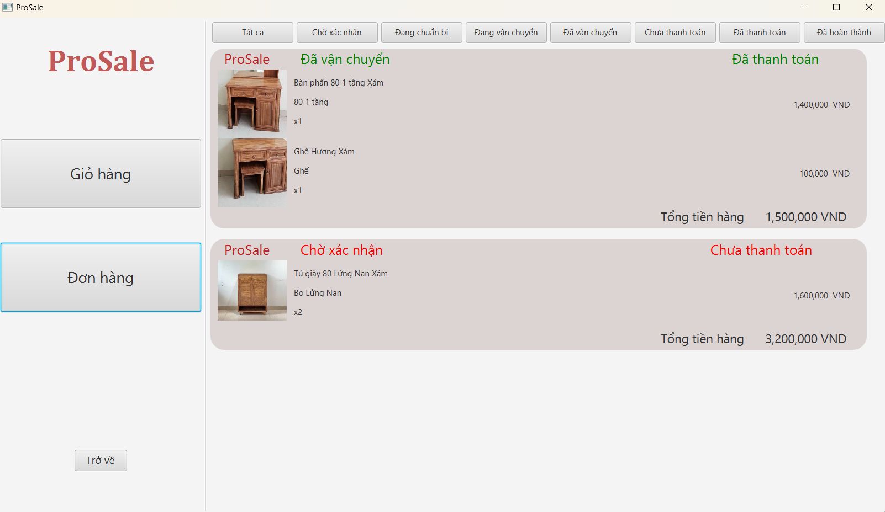
- Xem chi tiết từng đơn hàng.
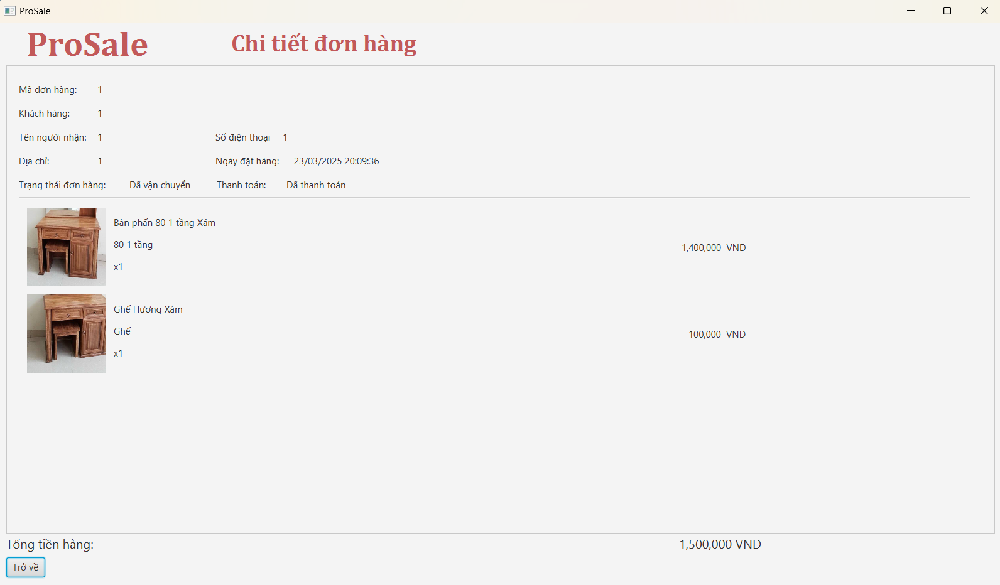
    


- Công nghệ sử dụng

  + Ngôn ngữ lập trình: Java

  + Giao diện: JavaFX, SceneBuilder (FXML), CSS

  + Mô hình kiến trúc: MVC (Model - View - Controller)

## Cấu trúc thư mục

## File Structure
```bash
ProSale/
│── src/
│   ├── main/
│   │   ├── java
│   │   │   ├── ProSale
│   │   │   │   ├── controller
│   │   │   │   │   ├── AddNewProductController
│   │   │   │   │   ├── AdminDonHangController
│   │   │   │   │   ├── AdminTabController
│   │   │   │   │   ├── DemoController
│   │   │   │   │   ├── DonHangController
│   │   │   │   │   ├── DonHangItemController 
│   │   │   │   │   ├── GioHangItemController
│   │   │   │   │   ├── GridListProductsController
│   │   │   │   │   ├── LoginTabController
│   │   │   │   │   ├── MainViewController
│   │   │   │   │   ├── MuaHangController
│   │   │   │   │   ├── MuaHangItemController
│   │   │   │   │   ├── MyListener
│   │   │   │   │   ├── OrderDetailController
│   │   │   │   │   ├── OrderItemController
│   │   │   │   │   ├── ProductDetailController
│   │   │   │   │   ├── ProductPreViewHorizontalController
│   │   │   │   │   ├── ProductPreViewVerticalController
│   │   │   │   │   ├── ProfileTabController
│   │   │   │   │   ├── SignUpTabController
│   │   │   │   │   ├── ThongKeController
│   │   │   │   ├── images
│   │   │   │   │   ├── MainView.Home
│   │   │   │   │   ├── product 
│   │   │   │   │   │   ├── banPhan
│   │   │   │   │   │   ├── ghe
│   │   │   │   │   │   ├── guong
│   │   │   │   │   │   ├── tuDauGiuong
│   │   │   │   │   │   ├── tuGiay
│   │   │   │   ├── manager
│   │   │   │   │   ├── comparator
│   │   │   │   │   ├── AdminManager
│   │   │   │   │   ├── IDManager
│   │   │   │   │   ├── IOSystem
│   │   │   │   │   ├── PersonManager
│   │   │   │   │   ├── ProductManager
│   │   │   │   │   ├── SaveImageToResource
│   │   │   │   ├── model
│   │   │   │   │   ├── order
│   │   │   │   │   │   ├── GioHang
│   │   │   │   │   │   ├── Order
│   │   │   │   │   │   ├── OrderItem
│   │   │   │   │   │   ├── OrderItemDemo
│   │   │   │   │   ├── person
│   │   │   │   │   │   ├── Admin
│   │   │   │   │   │   ├── Person
│   │   │   │   │   │   ├── User
│   │   │   │   │   ├── product
│   │   │   │   │   │   ├── BanPhan
│   │   │   │   │   │   ├── Ghe 
│   │   │   │   │   │   ├── Guong
│   │   │   │   │   │   ├── Product
│   │   │   │   │   │   ├── TuDauGiuong
│   │   │   │   │   │   ├── TuGiay
│   │   │   │   ├── utilz
│   │   │   │   │   ├── FormatterFactory
│   │   │   │   │   ├── ImagePath
│   │   │   │   ├── AppLaunch
│   │   │   │   ├── AppServer
│   │   ├── resources
│   │   │   ├── images/
│   │   │   │   ├── META_INF
│   │   │   │   │   ├── MANIFESR.MF
│   │   │   │   ├── ProSale
│   │   │   │   │   ├── css
│   │   │   │   │   │   ├── DonHangItem.css
│   │   │   │   │   │   ├── LoginTab.css
│   │   │   │   │   │   ├── MainView.css
│   │   │   │   │   │   ├── ProductPreviewHorizontal.css
│   │   │   │   │   │   ├── ScrollPane.css
│   │   │   │   │   │   ├── signUpTabStyle.css
│   │   │   │   │   ├── data
│   │   │   │   │   │   ├── id.txt
│   │   │   │   │   │   ├── order.txt
│   │   │   │   │   │   ├── product.txt
│   │   │   │   │   │   ├── person.txt
│   │   │   │   │   │   ├── userData.txt
│   │   │   │   │   ├── FXML
│   │   │   │   │   │   ├── AddNewProduct.fxml
│   │   │   │   │   │   ├── AdminDonHang.fxml
│   │   │   │   │   │   ├── AdminTab.fxml
│   │   │   │   │   │   ├── Demo.fxml
│   │   │   │   │   │   ├── DonHang.fxml
│   │   │   │   │   │   ├── DonHangItem.fxml
│   │   │   │   │   │   ├── GioHangItem.fxml
│   │   │   │   │   │   ├── GridListProducts.fxml
│   │   │   │   │   │   ├── LoginTab.fxml
│   │   │   │   │   │   ├── MainView.fxml
│   │   │   │   │   │   ├── MuaHang.fxml
│   │   │   │   │   │   ├── MuaHangItem.fxml
│   │   │   │   │   │   ├── OrderDetail.fxml
│   │   │   │   │   │   ├── OrderItem.fxml
│   │   │   │   │   │   ├── ProductDetail.fxml
│   │   │   │   │   │   ├── ProductPreviewHorizontal.fxml
│   │   │   │   │   │   ├── ProductPreviewVertical.fxml
│   │   │   │   │   │   ├── ProfileTab.fxml
│   │   │   │   │   │   ├── SignUpTab.fxml
│   │   │   │   │   │   ├── ThongKe.fxml
│   │   │   │   │   ├── icons
│   │   │   │   │   ├── images
```
## UML

**Activity Diagram**

**Class Diagram**

## Hướng dẫn cài đặt

- Clone repository:

> git clone https://github.com/lucnguyen1375/ProSale.git

- Mở dự án bằng IDE (IntelliJ, Eclipse, NetBeans).

- Chạy ứng dụng:

  + Cách 1: Mở Main.java và chạy chương trình.

  + Cách 2: Mở ProSale.bat và chạy chương trình.

## Hướng dẫn sử dụng

+ Đăng ký tài khoản: Nhập họ tên, tên đăng nhập và mật khẩu để tạo tài khoản.

+ Đăng nhập: Sử dụng thông tin tài khoản đã đăng ký để truy cập ứng dụng.


## Video Hướng dẫn

> https://www.youtube.com/watch?v=lYCJaCfav0Q&ab_channel=LucNguyen

Đóng góp

> Nếu bạn muốn đóng góp cho dự án, vui lòng tạo pull request hoặc gửi mail cho mình để thảo luận.

---

Liên hệ

Author: Luc Nguyen

Email: luchuubang@gmail.com

Facebook: https://www.facebook.com/luc.nguyen1375

Github: https://github.com/lucnguyen1375

